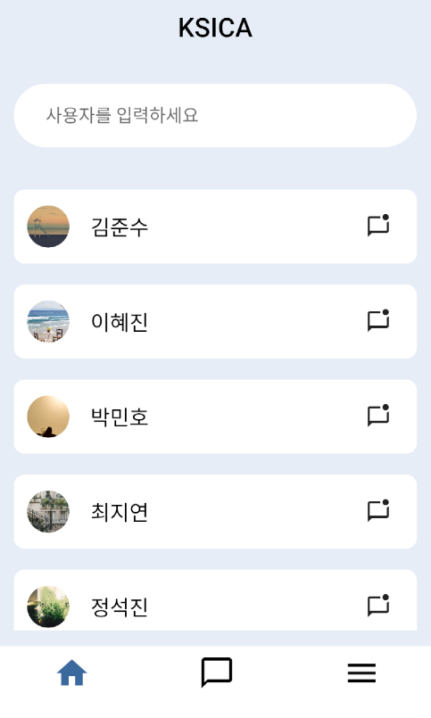
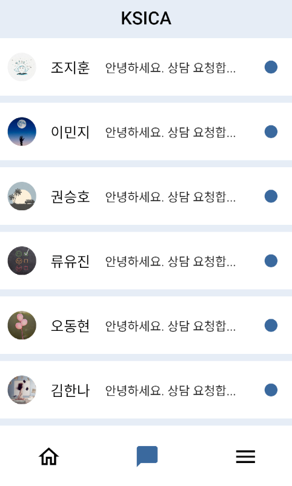
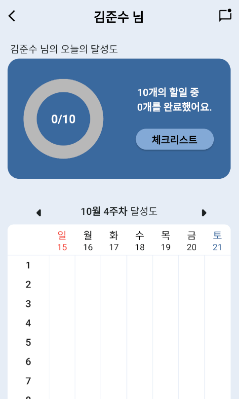
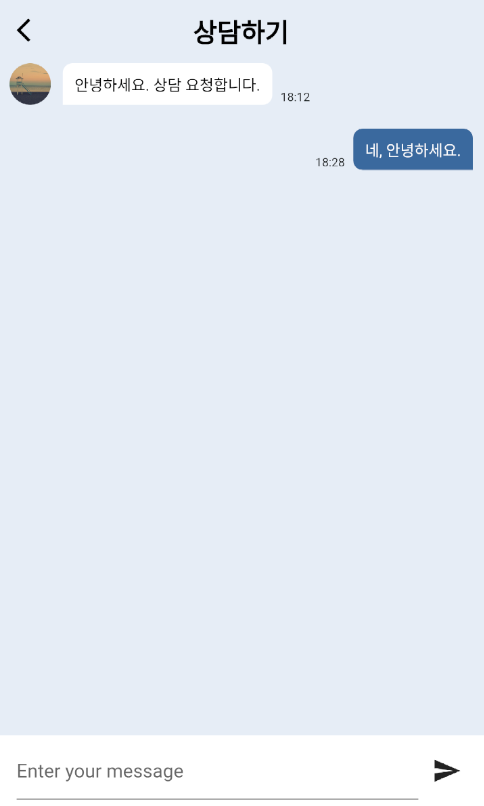

<a name="readme-top"></a>

[![Contributors][contributors-shield]][contributors-url]
[![Forks][forks-shield]][forks-url]
[![Stargazers][stars-shield]][stars-url]
[![Issues][issues-shield]][issues-url]

<!-- PROJECT LOGO -->
<br />
<div align="center">
  <a href="https://github.com/skj974600/kscia-admin-app">
    
  </a>

  <h3 align="center">KSCIA ADMIN APP</h3>

  <p align="center">
    Admin App for managing and consulting KSCIA app users 
    <br />
    <a href="https://github.com/skj974600/kscia-admin-app"><strong>Explore the docs »</strong></a>
    <br />
    <br />
    <a href="https://github.com/skj974600/kscia-admin-app">View Demo</a>
    ·
    <a href="https://github.com/skj974600/kscia-admin-app/issues">Report Bug</a>
    ·
    <a href="https://github.com/skj974600/kscia-admin-app/issues">Request Feature</a>
  </p>
</div>

<!-- TABLE OF CONTENTS -->
<details>
  <summary>Table of Contents</summary>
  <ol>
    <li>
      <a href="#about-the-project">About The Project</a>
      <ul>
        <li><a href="#built-with">Built With</a></li>
      </ul>
    </li>
    <li>
      <a href="#getting-started">Getting Started</a>
      <ul>
        <li><a href="#prerequisites">Prerequisites</a></li>
        <li><a href="#installation">Installation</a></li>
      </ul>
    </li>
    <li><a href="#usage">Usage</a></li>
    <li><a href="#contact">Contact</a></li>
  </ol>
</details>

<!-- ABOUT THE PROJECT -->

## About The Project

<!-- ![Product Screen Shot][product-screenshot] -->
<div style="display: flex; justify-content: space-between;">
    
    
    
    
</div>

&nbsp;

While there are websites dedicated to individuals with spinal cord injuries, there seemed to be a noticeable absence of mobile applications catering to their specific needs. Recognizing the physical challenges these individuals face, we believed that an easily accessible and user-friendly app was essential. Our goal was to provide on-the-go support and help foster a sense of community. Thus, we embarked on the development of a "Lifestyle App for Individuals with Spinal Cord Injuries". This app was crafted using the cross-platform framework, Flutter, ensuring compatibility with both Android and iOS devices. The backend, which provides the API, was developed using FastAPI.

Features include:

- A direct link to the Spinal Cord Injury Association website.
- A real-time chat system for counseling.
- Health and hygiene programs and checklists.

Through this app, we hope to simplify access to the services provided to individuals with spinal cord injuries, potentially enhancing their quality of life.

The current repository focuses on the admin app component.

<p align="right">(<a href="#readme-top">back to top</a>)</p>

### Built With

This section lists major frameworks/systems used to this project.

- [![Flutter][Flutter]][Flutter-url]

<p align="right">(<a href="#readme-top">back to top</a>)</p>

<!-- GETTING STARTED -->

## Getting Started

This is an example of how you may give instructions on setting up your project locally.
To get a local copy up and running follow these simple example steps.

### Prerequisites

Install flutter and android studio and create an emulator.

- [Flutter Install][Flutter-Install-url]
- [Android Studio Intall][Android-Studio-Install-url]
- [Run Emulator][Run-Emulator-url]

### Installation

_Below is an example of how you can install and set up your app._

1. Clone the repo

   ```sh
   git clone https://github.com/skj974600/kscia-admin-app.git
   ```

2. Install packages and run

   ```sh
   flutter pub get
   flutter run lib/main.dart
   ```

<p align="right">(<a href="#readme-top">back to top</a>)</p>

<!-- USAGE EXAMPLES -->

## Usage

<div style="display: flex; margin-bottom: 2rem;">
    
    <div >
      <ul style="display:flex;flex-direction:column;">
        <span>&nbsp;</span><li style="margin-bottom:1rem;">Home screen</li>
        &nbsp;<li style="margin-bottom:1rem;">User list viewable</li>
        &nbsp;<li style="margin-bottom:1rem;">Search and view users</li>
        &nbsp;<li style="margin-bottom:1rem;">Tap on a user to check the user's checklist status</li>
        &nbsp;<li style="margin-bottom:1rem;">Clicking the chat icon redirects to the counseling page</li>
        &nbsp;<li style="margin-bottom:1rem;">New messages displayed if available</li>
      </ul>
    </div>
</div>
<br clear="left"/>
&nbsp;
<div style="display:flex; margin-bottom:2rem;">
    
    <div>
      <ul style="display:flex;flex-direction:column;">
        <li style="margin-bottom:1rem;">Chat room list screen</li>
        &nbsp;<li style="margin-bottom:1rem;">Listed in order of most recent messages</li>
        &nbsp;<li style="margin-bottom:1rem;">Display new message notifications</li>
        &nbsp;<li style="margin-bottom:1rem;">Show last message</li>
        &nbsp;<li style="margin-bottom:1rem;">Click to move to consultation page</li>
      </ul>
    </div>
</div>
<br clear="left"/>
&nbsp;

<div style="display:flex; margin-bottom:2rem;">
    
    <div>
      <ul style="display:flex;flex-direction:column;">
        <li style="margin-bottom:1rem;">User information screen</li>
        &nbsp;<li style="margin-bottom:1rem;">Donut chart of user’s today’s checklist performance</li>
        &nbsp;<li style="margin-bottom:1rem;">Table showing user checklist performance by week</li>
        &nbsp;<li style="margin-bottom:1rem;">Display completed checklists</li>
        &nbsp;<li style="margin-bottom:1rem;">Click the chat icon to go to the consultation screen</li>
      </ul>
    </div>
</div>
<br clear="left"/>
&nbsp;

<div style="display:flex; margin-bottom:2rem;">
    
    <div>
      <ul style="display:flex;flex-direction:column;">
        <li style="margin-bottom:1rem;">Consultation screen</li>
        &nbsp;<li style="margin-bottom:1rem;">Consultation with users in real time is possible and the consultation details are saved</li>
      </ul>
    </div>
</div>
<br clear="left"/>
&nbsp;

<p align="right">(<a href="#readme-top">back to top</a>)</p>

## Contact

`Letmedev` - <79841@naver.com>

Project Link: [https://github.com/skj974600/kscia-admin-app](https://github.com/skj974600/kscia-admin-app)

<p align="right">(<a href="#readme-top">back to top</a>)</p>

<!-- MARKDOWN LINKS & IMAGES -->

[contributors-shield]: https://img.shields.io/github/contributors/skj974600/kscia-admin-app.svg?style=for-the-badge
[contributors-url]: https://github.com/skj974600/kscia-admin-app/graphs/contributors
[forks-shield]: https://img.shields.io/github/forks/skj974600/kscia-admin-app.svg?style=for-the-badge
[forks-url]: https://github.com/skj974600/kscia-admin-app/network/members
[stars-shield]: https://img.shields.io/github/stars/skj974600/kscia-admin-app.svg?style=for-the-badge
[stars-url]: https://github.com/skj974600/kscia-admin-app/stargazers
[issues-shield]: https://img.shields.io/github/issues/skj974600/kscia-admin-app.svg?style=for-the-badge
[issues-url]: https://github.com/skj974600/kscia-admin-app/issues
[product-screenshot]: images/readme/product_screenshot.png
[Flutter]: https://img.shields.io/badge/Flutter-%2302569B.svg?style=for-the-badge&logo=Flutter&logoColor=white
[Flutter-url]: https://flutter.dev/
[Flutter-install-url]: https://docs.flutter.dev/get-started/install
[Android-Studio-install-url]: https://developer.android.com/studio
[Run-Emulator-url]: https://developer.android.com/studio/run/emulator?hl=en
